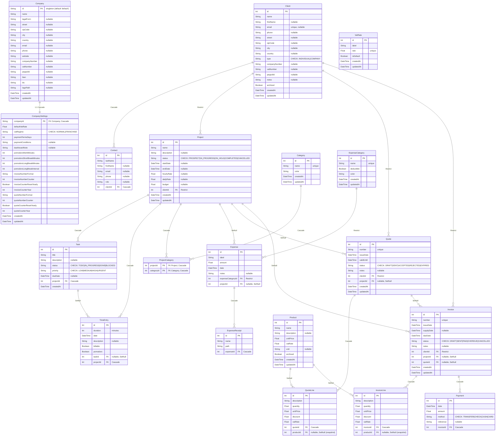

# Sole — CRM pour indépendants

> Application desktop locale pour gérer son activité de freelance : clients, projets, time tracking, devis, factures et notes de frais. Aucun cloud, aucun abonnement.

---

## Contexte scolaire

| | |
|---|---|
| **Établissement** | IETC — Institut d'Enseignement Technique Commercial |
| **Cours** | SGBD — Systèmes de Gestion de Bases de Données |
| **Niveau** | Bachelier 2 |
| **Étudiant** | Julien Paquet |
| **Deadline** | 31 mai 2026 |

Ce projet est le travail de fin d'unité du cours SGBD. Il démontre la maîtrise de la modélisation relationnelle, des relations Prisma (1:N, 1:1, N:M explicite, cascade, restrict, setNull), des agrégats, du CRUD complet, et de l'intégration dans une application TypeScript full-stack.

---

## Stack

| Couche | Technologie |
|---|---|
| Runtime desktop | [Electron Forge](https://www.electronforge.io/) v7 |
| Frontend | [Angular](https://angular.dev/) 21 — standalone components, signals, zoneless |
| ORM | [Prisma](https://www.prisma.io/) v7 — schéma multi-fichiers |
| Base de données | SQLite via `better-sqlite3` |
| Génération PDF | pdfmake (côté main process) |
| i18n | FR · EN · NL · DE (renderer + main) |
| Bundler | Vite (plugin Electron Forge) |
| Langage | TypeScript strict (main · preload · shared · renderer) |

---

## Fonctionnalités

### CRUD principal
- **Clients** — entreprises et particuliers, contacts multiples, archivage
- **Projets** — rattachés à un client, statuts, catégories N:M, taux horaire/journalier, budget
- **Tâches** — priorités, statuts, date limite, vue Kanban / Liste
- **Time tracking** — saisie manuelle ou Pomodoro, entrées facturables/non-facturables, agrégats par mois/projet
- **Devis** — workflow brouillon → envoyé → accepté/refusé/expiré, lignes éditables, multi-TVA
- **Factures** — lignes éditables, totaux HT/TVA/TTC calculés, paiements partiels, statut recalculé (payée/en retard…)
- **Notes de frais** — catégories, montant déductible, justificatifs multiples, total déductible annuel

### Features cross-cutting (Phase 11)
- **Welcome Wizard** au premier lancement — crée l'entreprise + choix seed démo / base vide ; **i18n 4 langues** (FR/EN/NL/DE)
- **Conversion Devis → Projet + factures** — facture d'acompte puis facture de solde (lien `Invoice.quoteId`)
- **Multi-TVA & catalogue** — taux de TVA configurables (seed 21/12/6/0), catalogue produits, TVA **par ligne** avec ventilation par taux
- **Régime de TVA** — assujetti vs franchise + **autoliquidation intra-UE** (mentions légales au PDF)
- **Génération PDF** — facture et devis mis en page côté main (pdfmake), logo, remise par ligne
- **Dashboard à widgets** déplaçables/redimensionnables — KPIs + **graphes SVG** maison (revenus vs dépenses par mois, dépenses par catégorie en donut, heures par projet, pipeline devis & factures par statut) + note rapide persistée en base
- **Pomodoro intégré** — cycles configurables (défaut 25/5/15 min) loggés automatiquement dans `TimeEntry` (flag `pomodoro`), pastille navbar, survie au redémarrage
- **Notifications OS natives** — fin de pomodoro (Windows / Linux / macOS, via l'API `Notification` d'Electron)

---

## Modélisation — 19 modèles Prisma

> Les noms de modèles/colonnes sont **en anglais** (code et base), même si la spec et l'UI utilisent le français (ex. `Project` = Projet, `TimeEntry` = TempsPasse, `Quote` = Devis). Les champs « enum » sont stockés en **TEXT + contrainte CHECK** (pas d'enum Prisma) pour rester portable. Les **totaux des devis/factures ne sont pas stockés** : ils sont calculés depuis les lignes (normalisation).



> `VatRate` est une **table de référence** (taux configurables, un seul `isDefault`). Les lignes de devis/facture **ne référencent pas** `VatRate` par FK : elles **snapshotent** la valeur numérique du taux (`Float`) — intégrité historique si un taux change plus tard.

| Notion SGBD | Démonstration dans Sole |
|---|---|
| Clé primaire | `Int @id @default(autoincrement())` sur 16 tables · `Company.id` = `String` singleton (`@default("default")`) · `CompanySettings` : PK = FK `companyId` (1:1) · `ProjectCategory` : PK composite `@@id([projectId, categoryId])` |
| Relation 1:N | Client→Project, Project→Task/TimeEntry, Invoice→InvoiceLine/Payment, Expense→ExpenseReceipt… |
| Relation 1:1 | Company ↔ CompanySettings |
| Relation N:M explicite | `ProjectCategory` (table de jonction, PK composite) entre Project et Category |
| `onDelete: Cascade` | Supprimer un projet supprime ses tâches/temps ; supprimer une facture supprime ses lignes + paiements |
| `onDelete: Restrict` | Impossible de supprimer un client lié à des projets/devis/factures, ou une catégorie de dépense utilisée |
| `onDelete: SetNull` | Supprimer une tâche conserve les `TimeEntry` (`taskId`→null) ; supprimer un produit conserve les lignes (snapshot conservé) |
| Contrainte CHECK | Champs « enum » en TEXT+CHECK, ex. `Invoice.status IN ('DRAFT','SENT','PAID','OVERDUE','CANCELLED')` — ajoutée à la main dans la migration (compat SQLite + portable PostgreSQL) |
| Unicité | `Client.email`, `Category.name`, `ExpenseCategory.name`, `Quote.number`, `Invoice.number`, `VatRate.rate` |
| JOIN via `include` | `prisma.project.findMany({ include: { client: true, tasks: true } })` |
| Agrégats | `prisma.timeEntry.aggregate({ _sum: { duration: true } })`, `groupBy` (compteurs par statut, ventilation TVA par taux) |
| Normalisation | Totaux devis/facture **non stockés** : HT/TVA/TTC calculés depuis les lignes ; TVA **par ligne** avec ventilation par taux |

---

## Architecture Electron

### Les 4 couches (frontières de processus)

Sécurité Electron stricte : `contextIsolation: true`, `sandbox: true`, `nodeIntegration: false`. Le renderer n'a **aucun accès Node** — il ne parle au main **que** via `window.api.*` (exposé par le preload avec `contextBridge`) et des canaux IPC typés.

| Couche | Process | Rôle | Accès |
|---|---|---|---|
| `renderer/` | Chromium | UI Angular (standalone, signals, zoneless) | `window.api.*` uniquement |
| `preload/` | pont sandboxé | expose `window.api`, relaie en `ipcRenderer.invoke` | bridge isolé |
| `shared/` | — | contrats communs : channels · DTOs · interfaces · types | importé par preload **et** renderer |
| `main/` | Node.js | Prisma · SQLite · PDF · notifications · dialogues | accès système complet |

### Le trajet complet d'un appel — ex. « créer un client »

```
UTILISATEUR ▸ clique « Enregistrer » dans une page Angular
   │
   ▼  RENDERER ─────────────────────────────────────────────────────────
   Component (reactive form)
        └─▶ ClientStore.add(dto)      orchestration · état (signals) · toast/erreur
              └─▶ ClientService.add(dto)   wrappe window.api · throw si res.error
   │
   │   window.api.client.add(dto)                       ◀── contextBridge
   ▼  PRELOAD (sandbox) ────────────────────────────────────────────────
   apis/client.api.ts → ipcRenderer.invoke(CLIENT_CHANNELS.ADD, dto)
   │                    (canal + types importés de shared/)
   ▼  MAIN (Node.js) ───────────────────────────────────────────────────
   ipcMain.handle  ◀── enveloppé par  ipcHandle(CHANNEL, CreateClientSchema, fn)
        1) Zod .parse(dto)              validation à la frontière IPC
        2) DbContext.transaction(…)     transaction ambiante (AsyncLocalStorage)
        3) ClientService.add(dto)       logique métier + toDto (Prisma → DTO)
        4) ClientRepository             extends BaseRepository
        5) PrismaClient (better-sqlite3)  ◀──▶  SQLite (dev.db)
   │
   ▼  RETOUR (même chemin en sens inverse)
   IpcResponse<ClientDto> = { data, error: null }
        exception ⇒ toIpcError ⇒ { data: null, error: { message } } ⇒ toast rouge
```

### Un « bundle » = 12 étapes à travers les couches

Chaque entité est construite end-to-end selon le **même pipeline de 12 étapes** (le bundle Client sert de template canonique). C'est ce qui rend l'architecture régulière et défendable :

| # | Couche | Fichier(s) | Rôle |
|---|---|---|---|
| 1 | DB | `prisma/schema/<entity>.prisma` | modèle Prisma (1 fichier par modèle) |
| 2 | DB | `prisma/migrations/…_add_<entity>` | migration SQL (1 par phase) + CHECK ajoutés à la main |
| 3 | shared | `dtos/<entity>/` | interface DTO (read) + schémas **Zod** (create/update) |
| 4 | shared | `channels/<entity>/` | enum `<ENTITY>_CHANNELS` (noms de canaux IPC) |
| 5 | shared | `interfaces/<entity>/` | contrat `<Entity>API` (signatures preload ↔ renderer) |
| 6 | main | `repositories/<entity>/` | accès données Prisma (extends `BaseRepository`) |
| 7 | main | `services/<entity>/` | logique métier + mapping Prisma → DTO (`toDto`) |
| 8 | main | `handlers/<entity>/` | `registerXHandlers` via `ipcHandle(channel, zod, fn)` |
| 9 | main | `dependencies/<entity>/` | factory repo + service (DI) + câblage des index |
| 10 | preload | `apis/<entity>.api.ts` | `ipcRenderer.invoke` + `window.api.x` (+ type `d.ts` renderer) |
| 11 | renderer | `services/` + `stores/<entity>/` | wrapper `window.api` + état (signals) |
| 12 | renderer | `features/<entity>/` | page + composants, route, i18n FR/EN/NL/DE, lien nav |

> Les **sous-entités** (Contact, QuoteLine, InvoiceLine, Payment, ExpenseReceipt, ProjectCategory) n'ont **pas** de bundle propre : elles sont modélisées avec leur parent, manipulées via le service parent (diff/sync), et affichées dans la page détail du parent.

### Sous-architecture du renderer (3 couches)

```
Composant / Page  ──▶  XStore  ──▶  XService  ──▶  window.api.x
 (logique de form)     (signals)    (wrapper IPC)
```

- **`XService`** (`@app/services`) — enveloppe `window.api.x`, `throw` si `res.error`, renvoie le DTO.
- **`XStore`** (`@app/stores`, `providedIn: 'root'`) — orchestration async, état en **signals**, toasts succès/erreur (`ToastService` / `ErrorService` / `I18nService`).
- **Composant / Page** — formulaires réactifs ; *la logique de form vit dans le composant, jamais dans le store*.

### Infra transverse (écrite une fois, réutilisée partout)

- **`ipcHandle(channel, zodSchema, fn)`** — enveloppe chaque appel : **validation Zod** à la frontière + **transaction ambiante** (`DbContext` + `AsyncLocalStorage`, les services ignorent la transactionnalité) + `toIpcError` → réponse uniforme `IpcResponse<T> = { data, error }`. Variante **`ipcHandleNoTx`** (dialogues, PDF, notifications) = sans transaction.
- **`BaseRepository`** — CRUD générique + `searchFields` ; tous les repos en héritent (sauf le singleton `Company`).
- **Migrator maison** — applique les migrations au démarrage (`main/database`), pas de commande manuelle.
- **i18n des deux côtés** — `main/i18n` (messages d'erreur) + `renderer/i18n` (UI, 4 langues, **lazy par locale**).
- **`core/file-storage`** — copie des justificatifs de dépense dans `userData/storage/<scope>/<année>/…`.

### Arborescence

```
src/
├── main/                     # Node.js
│   ├── index.ts              # lifecycle Electron + boot (migrator → DI → handlers → window)
│   ├── core/                 # ipcHandle/ipcHandleNoTx, DbContext (tx ambiante), logger, file-storage
│   ├── database/             # migrator maison (migrations au démarrage)
│   ├── dependencies/         # factories DI (composition root)
│   ├── handlers/             # handlers IPC (1 par entité + log/i18n/pdf/notification)
│   ├── repositories/         # accès Prisma (extends BaseRepository)
│   ├── services/             # logique métier + mapping → DTO
│   └── i18n/                 # messages d'erreur (FR/EN)
├── preload/
│   ├── index.ts              # contextBridge → window.api
│   └── apis/                 # 1 api.ts par entité (ipcRenderer.invoke)
├── shared/                   # importé par preload + renderer
│   ├── channels/             # enums de canaux IPC
│   ├── dtos/                 # DTOs (read) + schémas Zod (create/update)
│   ├── interfaces/           # contrats d'API
│   ├── types/                # IpcResponse, FindManyArgs…
│   ├── validators/           # validateurs Zod partagés
│   └── utils/                # helpers purs (format, TVA…)
└── renderer/                 # app Angular
    └── src/app/              # services → stores → features (+ shared/components, i18n, layout)

prisma/
├── schema/                   # schéma multi-fichiers (1 .prisma par modèle)
├── migrations/               # SQL versionné (1 migration par phase)
└── generated/                # client TypeScript généré (gitignored)
```

---

## Installation et démarrage

### En 1 minute — utiliser l'app (binaires)

Télécharge l'installateur pour ton OS depuis la **[page Releases du dépôt](https://github.com/ZekJulien/IETC-sole-crm/releases)** :

| OS | Fichier | Installation |
|---|---|---|
| Windows 10/11 | `Sole-win32-x64-<version>.zip` | Décompresser → double-clic sur `sole.exe` |
| macOS | `Sole-darwin-arm64-<version>.zip` | Décompresser → **clic droit → Ouvrir** (Gatekeeper) |
| Linux (Debian/Ubuntu) | `sole_<version>_amd64.deb` | `sudo dpkg -i sole_<version>_amd64.deb` |

Lance **Sole** depuis le menu de ton OS. Au premier démarrage, le **Welcome Wizard** propose le **mode démo** qui crée automatiquement un jeu de données complet (clients, projets, devis, factures payées/impayées/en retard, dépenses, time tracking, pomodoros) — l'app est immédiatement utilisable et le tableau de bord rempli.

> **Binaires non signés** (pas de certificat éditeur — c'est un projet d'études) :
> - **macOS** : premier lancement = clic droit → Ouvrir.
> - **Windows** : SmartScreen → « Plus d'infos » → « Exécuter quand même ».

### En mode développement

```bash
# 1. Installer les dépendances (root + renderer via postinstall)
npm install

# 2. Générer le client Prisma TypeScript
npm run prisma:generate

# 3. Lancer l'application (Electron + renderer en build statique)
npm start

# OU mode HMR (Angular dev server + Electron, live reload)
npm run dev
```

> Les migrations sont appliquées automatiquement au démarrage via le migrator maison — aucune commande supplémentaire. Au premier lancement, le **Welcome Wizard** crée l'entreprise et propose un jeu de données de démo (identique au binaire).

**Modifier le schéma :**
```bash
npm run prisma:migrate
```

**Parcourir les données :**
```bash
npm run prisma:studio
```

---

## Build / packaging

**Local — un seul OS** (celui de la machine, car `better-sqlite3` est un natif non cross-compilable) :
```bash
npm run make    # → out/make/  (installateur pour l'OS courant)
```

**Cross-platform (Windows + macOS + Linux)** — workflow GitHub Actions (`.github/workflows/build.yml`) qui build les trois en parallèle sur des runners natifs et attache les installateurs à une **Release** GitHub.

- **Déclenchement automatique** sur push d'un tag `v*` :
  ```bash
  git tag v0.21.0
  git push --tags
  ```
- **Déclenchement manuel** via l'onglet **Actions** → « Build installers » → « Run workflow ».
