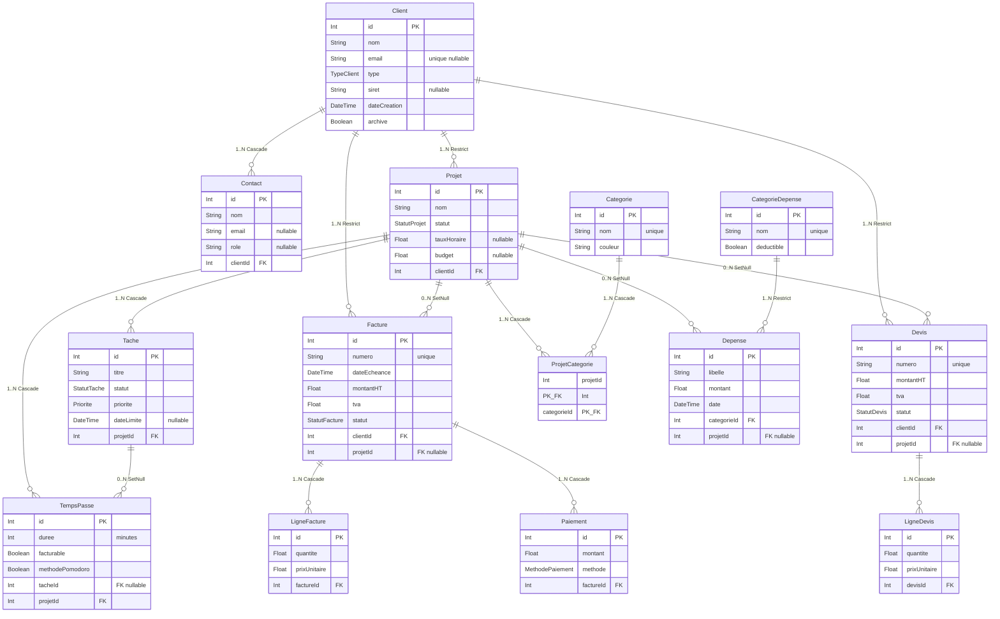

# Sole — CRM pour indépendants

> Application desktop locale pour gérer son activité de freelance : clients, projets, time tracking, devis, factures et notes de frais. Aucun cloud, aucun abonnement.

---

## Contexte scolaire

| | |
|---|---|
| **Établissement** | IETC — Institut d'Enseignement Technique Commercial |
| **Cours** | SGBD — Systèmes de Gestion de Bases de Données |
| **Niveau** | Bachelier 2 |
| **Étudiant** | Julien Paquet |
| **Deadline** | 31 mai 2026 |

Ce projet est le travail de fin d'unité du cours SGBD. Il démontre la maîtrise de la modélisation relationnelle, des relations Prisma (1:N, N:M explicite, cascade, restrict, setNull), des agrégats, du CRUD complet, et de l'intégration dans une application TypeScript full-stack.

---

## Stack

| Couche | Technologie |
|---|---|
| Runtime desktop | [Electron Forge](https://www.electronforge.io/) v7 |
| Frontend | [Angular](https://angular.dev/) 19 — standalone components, signals |
| ORM | [Prisma](https://www.prisma.io/) v7 — schéma multi-fichiers |
| Base de données | SQLite via `better-sqlite3` |
| Bundler | Vite (plugin Electron Forge) |
| Langage | TypeScript strict (main · preload · shared · renderer) |

---

## Fonctionnalités

### CRUD principal
- **Clients** — entreprises et particuliers, contacts multiples, historique automatique
- **Projets** — rattachés à un client, statuts, catégories N:M, taux horaire/journalier
- **Tâches** — priorités, statuts, date limite, rattachées à un projet
- **Time tracking** — chrono manuel ou Pomodoro, entrées facturables/non-facturables
- **Devis** — workflow brouillon → envoyé → accepté, conversion automatique en projet + facture
- **Factures** — lignes éditables, calcul HT/TVA/TTC, paiements partiels, statuts
- **Notes de frais** — catégories, montant déductible, justificatif, total annuel

### Features différenciantes
- **Pomodoro intégré** — cycle 25/5 min loggé automatiquement dans `TempsPasse` avec flag `methodePomodoro`
- **Génération PDF** — factures et devis en PDF mis en page côté main process
- **Dashboard analytics** — CA mensuel, répartition par client, heures facturables vs non-facturables, KPIs
- **Notifications natives Electron** — facture en retard, deadline approche, fin de Pomodoro
- **Recherche globale Cmd+K** — palette de commandes instantanée (clients, projets, factures, actions rapides)

---

## Modélisation — 14 modèles Prisma



| Notion SGBD | Démonstration |
|---|---|
| Clé primaire | `@id @default(autoincrement())` sur chaque table |
| Relation 1:N | Client→Projet, Projet→Tache, Facture→LigneFacture… |
| Relation N:M explicite | `ProjetCategorie` avec `@@id([projetId, categorieId])` |
| `onDelete: Cascade` | Supprimer un projet supprime ses tâches et entrées de temps |
| `onDelete: Restrict` | Impossible de supprimer un client qui a des factures |
| `onDelete: SetNull` | Supprimer une tâche conserve les `TempsPasse` (tacheId → null) |
| JOIN via `include` | `prisma.projet.findMany({ include: { client: true, taches: true } })` |
| Agrégat | `prisma.tempsPasse.aggregate({ _sum: { duree: true } })` |
| Enums | 7 enums : `TypeClient`, `StatutProjet`, `StatutTache`, `Priorite`, `StatutFacture`, `StatutDevis`, `MethodePaiement` |

---

## Architecture Electron

```
  Renderer (Angular)
  standalone · signals · reactive forms
        │
        │  window.api.*  (contextBridge)
        ▼
  Preload  ── sandbox: true
        │
        │  ipcRenderer.invoke / ipcMain.handle
        ▼
  Main process (Node.js)
  Prisma · SQLite · PDF · Notifications OS

  ─────────────────────────────────────────
  shared/   →  types · channels · DTOs
             importé par Preload + Renderer
```

```
src/
├── main/
│   ├── index.ts              # Lifecycle Electron
│   ├── bootstrap.ts          # Composition root
│   ├── core/                 # Logger + singleton PrismaClient
│   ├── database/             # Migration runner au démarrage
│   ├── dependencies/         # DI factories
│   ├── handlers/             # Handlers IPC
│   ├── repositories/         # Accès données Prisma
│   └── services/             # Logique métier
├── preload/
│   ├── index.ts              # contextBridge
│   └── apis/                 # Appels ipcRenderer.invoke
├── shared/
│   ├── channels/             # Constantes IPC
│   └── interfaces/           # DTOs + contrats partagés
└── renderer/                 # Angular app

prisma/
├── schema/                   # Schéma multi-fichiers
├── migrations/               # SQL versionné
└── generated/                # Client TypeScript généré (gitignored)
```

---

## Installation et démarrage

```bash
# Installer les dépendances (root + renderer via postinstall)
npm install

# Générer le client Prisma TypeScript
npm run prisma:generate

# Lancer l'application
npm start
```

> Les migrations sont appliquées automatiquement au démarrage via `database/migrator.ts` — aucune commande supplémentaire.

**Modifier le schéma :**
```bash
npm run prisma:migrate
```

**Parcourir les données :**
```bash
npm run prisma:studio
```

---

## Build / packaging

```bash
npm run make
```

Produit `.exe` (Windows), `.dmg` (macOS), `.deb` / `.rpm` (Linux) dans `out/`.
